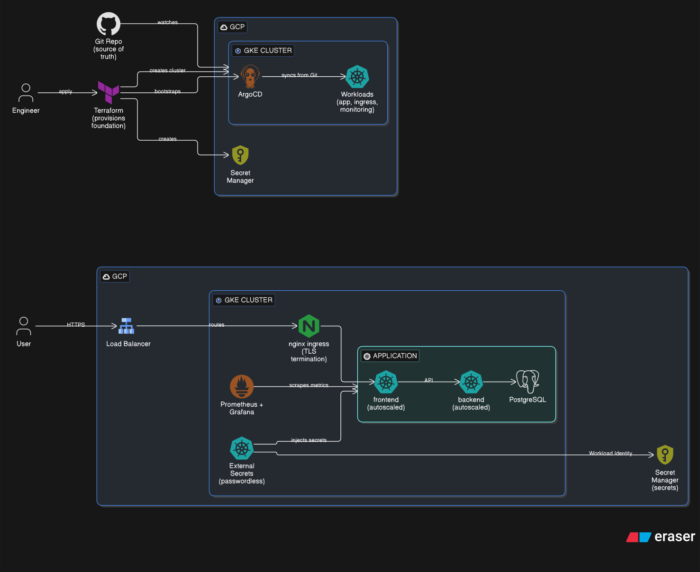

# Jerney on GKE — GitOps Platform

A production-style deployment of the **Jerney** 3-tier blog application on a
**GKE Standard** cluster, provisioned with **Terraform** and continuously
delivered with **ArgoCD** (App-of-Apps GitOps). The platform bundles ingress,
TLS, secret management, metrics, logs, and distributed tracing.

## Architecture



GitHub is the single source of truth. Terraform stands up the GKE cluster, VPC,
and Secret Manager, then bootstraps ArgoCD. ArgoCD watches `k8s-gke/apps/` and
reconciles every platform component into the cluster. Application traffic enters
through an NGINX ingress controller (regional L4 LB), terminating Let's Encrypt
TLS issued by cert-manager.

---

## Stack

| Layer | Component | Notes |
|---|---|---|
| Infra | **Terraform** | Private GKE Standard cluster, VPC, Cloud NAT, firewall, IAM, Secret Manager |
| GitOps | **ArgoCD** | App-of-Apps (with Kustomize env overlays), auto-sync + self-heal |
| Ingress | **ingress-nginx** | Service type `LoadBalancer` → regional L4 network LB |
| TLS | **cert-manager** | Let's Encrypt (HTTP-01) `letsencrypt-prod` ClusterIssuer |
| Secrets | **External Secrets Operator** | Syncs GCP Secret Manager → K8s Secrets via Workload Identity |
| App | **Jerney** | React frontend + Node.js backend + PostgreSQL (Bitnami chart) |
| Metrics | **kube-prometheus-stack** | Prometheus + Alertmanager + Grafana |
| Logs | **Loki + Promtail** | Log aggregation, surfaced in Grafana |
| Tracing | **SigNoz** | OpenTelemetry traces; backend exports OTLP to the SigNoz collector |

---

## Repository Layout

```
.
├── docs/
│   └── architecture.svg          # this diagram
│
├── infra/                       # flat Terraform structure (mirrors jerney-aks / jerney-eks)
│   ├── bootstrap/               # run first — creates the GCS bucket for TF remote state
│   ├── charts/                  # local Helm charts (e.g., cluster-secret-store)
│   ├── networking.tf            # VPC, VPC-native subnet, Cloud Router + Cloud NAT, firewall rules
│   ├── gke-cluster.tf           # Private GKE Standard cluster + node pool
│   ├── iam.tf                   # node SA + ESO SA + Workload Identity binding
│   ├── secrets.tf               # GCP Secret Manager secrets (map-driven)
│   ├── bootstrap.tf             # ArgoCD + ESO + ClusterSecretStore + root app
│   ├── variables.tf             # all input variables
│   ├── dev.tfvars.example       # per-environment values
│   └── README.md                # detailed Terraform / runbook docs
│
└── k8s-gke/
    ├── apps/                     # ArgoCD Applications (Kustomize overlays)
    │   ├── base/                 # base apps + sync waves (ingress-nginx, cert-manager, etc.)
    │   ├── dev/                  # dev overlay pointing to values-dev.yaml
    │   ├── staging/              # staging overlay
    │   └── prod/                 # prod overlay
    │
    ├── helm/jerney/              # app chart: frontend + backend + PostgreSQL dependency
    │   ├── values.yaml           # image tags, HPA, OTEL endpoint, ingress host
    │   └── templates/            # deployments, services, ingress, hpa, network-policies
    │
    └── platform/
        ├── external-secrets/     # ExternalSecrets (DB / Grafana / SMTP) — store created by TF
        ├── prometheus-stack/     # Grafana / Alertmanager / Prometheus values
        ├── loki-stack/           # Loki values
        └── ingress/              # letsencrypt-prod ClusterIssuer + per-host Ingresses
```

> **ESO + the ClusterSecretStore are installed by Terraform** (the `argocd-bootstrap`
> module), exactly like the `jerney-aks` / `jerney-eks` siblings — so they exist before
> any ArgoCD app that consumes secrets. Only the `ExternalSecret` resources stay in GitOps.

---

## ArgoCD Sync Waves

ArgoCD applies components in ordered waves so dependencies are ready before consumers:

| Wave | Apps | Why |
|---|---|---|
| **0** | `ingress-nginx`, `cert-manager` | Controllers/CRDs needed by everything else (ArgoCD + ESO come from Terraform) |
| **1** | `platform-secrets`, `prometheus-stack`, `jerney`, `signoz` | ExternalSecrets materialize, then apps consume them via `existingSecret` refs |
| **2** | `loki-stack`, `ingress-apps` | ClusterIssuer + Ingresses (cert-manager issues certs once DNS resolves) |

---

## Secrets Flow

Three secrets live in **GCP Secret Manager** (seeded by Terraform from `terraform.tfvars`)
and are synced into Kubernetes by ESO, which authenticates to GCP via **Workload Identity**
(a dedicated per-cluster ESO GCP service account, e.g. `jerney-gke-dev-eso`, no static keys):

| GCP Secret | K8s Secret (namespace) | Consumed by |
|---|---|---|
| `jerney-postgres-password` | `jerney-db-credentials` (`jerney`) | PostgreSQL via `postgresql.auth.existingSecret` |
| `jerney-grafana-admin-password` | `jerney-grafana-credentials` (`monitoring`) | Grafana admin login (`admin-user`/`admin-password` template) |
| `jerney-alertmanager-smtp-key` | `alertmanager-smtp-key` (`monitoring`) | Alertmanager SMTP (Resend, port 587) |

---

## Public Endpoints

All hosts resolve to the NGINX LoadBalancer IP and serve Let's Encrypt TLS:

| Host | Service |
|---|---|
| `jerney.nilkanthprojects.site` | Jerney blog (frontend + backend API) |
| `argocd.nilkanthprojects.site` | ArgoCD UI |
| `grafana.nilkanthprojects.site` | Grafana (metrics + logs) |
| `signoz.nilkanthprojects.site` | SigNoz (traces) |

---

## Quick Start

```bash
# 1. Authenticate
gcloud auth login
gcloud auth application-default login

# 2. Create the remote-state bucket (one-time)
cd infra/bootstrap && terraform init && terraform apply

# 3. Provision a cluster + bootstrap ArgoCD (pick an environment)
cd ../
terraform workspace new dev                    # or staging / prod
terraform workspace select dev
cp dev.tfvars.example dev.tfvars               # set project_id + the 3 secret values
terraform init
terraform apply -var-file="dev.tfvars"         # ~10 min

# 4. Point DNS at the NGINX LoadBalancer IP
kubectl get svc -n ingress-nginx ingress-nginx-controller \
  -o jsonpath='{.status.loadBalancer.ingress[0].ip}'
# create A records for jerney / argocd / grafana / signoz → that IP

# 5. Watch certs go READY
kubectl get certificate -A
```

ArgoCD takes over after `terraform apply` — no post-setup scripts. New application
images are rolled out by bumping the tags in `k8s-gke/helm/jerney/values.yaml`,
which ArgoCD detects and reconciles automatically.

> **Full runbook, cost strategy, IP ranges, and teardown:**
> see [infra/README.md](infra/README.md).

---

## Cost

The **dev** environment runs cheaply on the GCP free trial: single-zone cluster,
**Spot** `e2-medium` nodes (autoscale 1–3), `pd-standard` disks — roughly **$15–25/month**
plus the GKE management fee (~$72/month). `staging` and `prod` trade cost for stability
(on-demand nodes; prod uses `e2-standard-2`, min 2). All node/version settings —
including `kubernetes_version` (default **1.35**) — are per-environment in `terraform.tfvars`.
